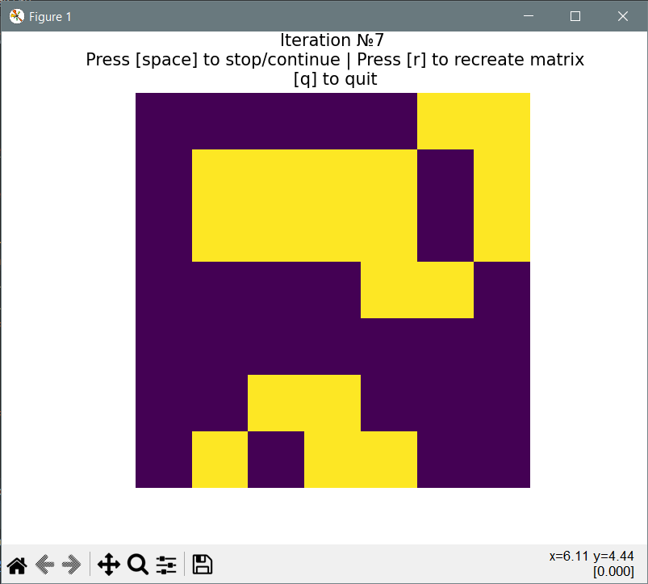

Data Science Camp Test Tasks

**Завдання 1:** Написати програму розв’язування систем 3 лінійних рівнянь з 3 невідомими, та вказати
розв’язок X системи AX= B, де

          [[1, 2, 3],         [[1],      [[?],
     A =   [0, 1, 2],    B =   [1],  X =  [?],
           [2, 0, 0]]          [0]]       [?]]

***Відповідь:***

● Розв’язок системи

    X.T = (0  -1  1)

● Код програми знаходиться у файлі task1.py. В цьому файлі розташовано три функції для розв'язання
СЛАР трьома різними шляхами:
 - За допомогою інваріантів (simple_solve)
 - За методом Крамера (kram)
 - За методом Гауса (gause)
---

**Завдання 2:** Написати програму, котра приймає на вхід матрицю зі значеннями 1 або 0 (живий або

мертвий стани) та ітеративно замінює значення в матриці за наступними правилами:

 - якщо в живої клітини два чи три живих сусіди, то вона лишається жити;

 - якщо в живої клітини один чи немає живих сусідів, то вона помирає від «самотності»;

 - якщо в живої клітини чотири та більше живих сусідів, то вона помирає від «перенаселення»;

 - якщо в мертвої клітини рівно три живих сусіди, то вона оживає.

Кожна клітинка має вісім сусідів.

***Як користуватися програмою***

Для початку роботи потрібно створити нове віртуальне середовище та встановити бібліотеки з requirements.txt:

    python3 -m venv venv_name
    source venv_name\bin\activate
    pip install -r requirements.txt

Скріпт task2.py приймає 1 обов'язковий аргумент -default та -width, -height.
    
    python task2.py --help

***Відповідь:***

У файлі task2.py розміщений код для зміни значення матриці. 
Щоб запустити файл, потрібно вказати параметр default який за замовчуванням True, тобто вхідна матриця буде мати вигляд:

                                   [[1, 0, 0, 0, 0, 0, 0],
                                    [0, 0, 1, 0, 0, 1, 1],
                                    [1, 0, 0, 1, 0, 0, 1],
                                    [0, 1, 1, 0, 1, 1, 0],
                                    [1, 1, 1, 1, 0, 0, 1],
                                    [1, 1, 1, 1, 1, 1, 1],
                                    [1, 1, 0, 1, 1, 0, 1]]

7 ітерація для матриці вище:  

                                    [[0, 0, 0, 0, 0, 1, 1],
                                     [0, 1, 1, 1, 1, 0, 1],
                                     [0, 1, 1, 1, 1, 0, 1],
                                     [0, 0, 0, 0, 1, 1, 0],
                                     [0, 0, 0, 0, 0, 0, 0],
                                     [0, 0, 1, 1, 0, 0, 0],
                                     [0, 1, 0, 1, 1, 0, 0]]

У графічному вигляді:

**Завдання 2.1\*:** Модифікувати програму так, щоб вона випадково генерувала початковий стан матриці з
заданим розміром і мала можливість безкінечно симулювати ітерації.

При запусці файлу task2.py можна вказати значення -default як False, в результаті чого матриця буде 
створенна автоматично. Також є додаткові параметри -width та -height для того, щоб вказати розмір вхідної 
матриці. За замовчування це буде матриця розмірністю 7х7
    

**Завдання 2.2\*\*:** Візуалізувати симуляцію ітерацій (matplotlib / seaborn / plotly / etc).

При запусці програми ми бачимо графік. Він буде кожної секунди змінюватися на наступний етап. Графічне 
зображення має наступні правила:
 - При натиску "space" анімація зупиняється.
 - При натиску "r" анімація починається з самого початку. (Для випадкових матриць генерує нову).
 - При натиску "q" вікно з анімацією зачиняється.

У разі, якщо всі клітини вимруть анімація зупиниться (для дефолтної матриці на 23 кроці), після чого анімація зупиняться.
У разі натиску пробіла, вона розпочнеться знову (для випадкових матриць також знову без змін).

---
**Завдання 3:** Ймовірність випадання сторони ‘H’ для кожної з 5 монет (назвемо їх m1, m2, m3, m4, m5) зі
зміщеним центром ваги рівна відповідно [0.1, 0.2, 0.4, 0.8, 0.9]. З монет навмання вибрали одну і почали
випробування. Визначити ймовірність випадання ‘H в наступному випробуванні після кожного з 8
фактично проведених випробувань:

[H H H T H T H H] (тут ‘T’ протилежна сторона монети).

Наприклад, до першого випробування ймовірність випадання ‘H’ рівна ~0.48 (за формулою повної
ймовірності, з урахуванням рівноможливості вибрати кожну монету з наявних). Після випадання ‘H’ в
першому випробуванні, ймовірності гіпотез, що вибрана монета є m1/m2/m3 зменшились, а відповідно
ймовірності гіпотез, що вибрана монета m4/m5 збільшились а, отже і змінилась ймовірність випадання ‘H’
в наступному (другому) випробуванні і стала рівною ~0.69. Аналогічно після випадання ‘H’ в другому
випробування треба переоцінити ймовірність випадання ‘H’ в третьому, і т.д.

***Відповідь***

● список ймовірностей з точністю до сотих  [0.69, 0.79, 0.83, 0.74, 0.8, 0.69, 0.76, 0.8]

● Для вирішення цієї задачі я використовував теорію Баєса:

Основна ідея:

    # Ми випадково витягнули монету, тому ймовірності кожної рівні 0.2
    P = [0.2, 0.2, 0.2, 0.2, 0.2]
    # Ймовірності випарання 'Н'
    A = [0.1, 0.2, 0.4, 0.8, 0.9]
    
    # Отже ймовірність випадання 'Н' рівна: A[1] * P[1] + A[2] * P[2] + ... + A[5] * P [5]
    H = sum([a * p for a, p in zip(A, P)]) # -> 0.48
    print(f"Probability of get H: {H}")
    
    # [Випало 'H']
    print("[FLIP 'H']")
    # Скористаємося теоремою Байєса та знайдемо нові ймовірності після випадання 'Н'
    # Нові ймовірності витягання кожної монети будуть наступні P[A1 | H] = P(A) * P(H | A) / P(H)
    for i in range(len(P)):
        P[i] = P[i] * A[i] / H # -> [0.041666666666666664, 0.08333333333333333, 0.16666666666666666, 0.3333333333333333, 0.375]
    print(f"New coins probability : {P}")
    
    # Отже ймовірність випадання 'Н' наступною є:
    H = sum([a * p for a, p in zip(A, P)]) #-> 0.6916666666666667
    print(f"New probability of get H: {H}")
    # Виконуємо ці кроки коли випало 'Н'
    # Інший варіант, випадання 'Т'
    # [Випало 'T']
    print("[FLIP 'T']")
    # Вцьому випадку нам потрібно інверсувати ймовірност для P(H) та P(H | A)
    # Якщо випало 'Т', ми повинні: P(A | T) = P(A) * P(T | A)       / P(T)      Або
    #                              P(A | H) = P(A) * (1 - P(H | A)) / (1 - P(H))
    for i in range(len(P)):
        P[i] *= (1. - A[i]) / (1 - H)
    print(f"New coins probability : {P}, {sum(P)}")
    
    # Отже нові ймовірності після випадання 'T':
    H = sum([a * p for a, p in zip(A, P)]) #-> 0.6916666666666667
    print(f"New probability of get H: {H}")
    # Повторюємо ці кроки коли випало 'T'

